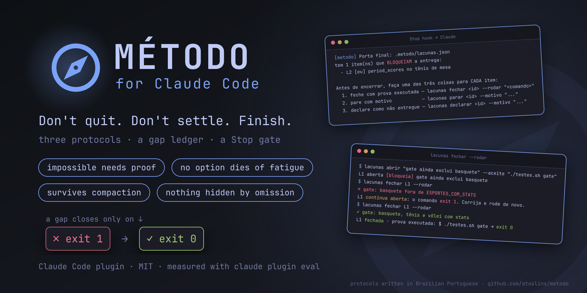

<p align="center">
  
</p>

<h1 align="center">Método</h1>

<p align="center"><strong>A Claude Code plugin that keeps the agent from quitting at the first obstacle, settling on the first solution, or delivering half the job.</strong></p>

<p align="center">
  <a href="https://github.com/atoslins/metodo/releases"></a>
  <a href="https://github.com/atoslins/metodo/actions/workflows/ci.yml"></a>
  <a href="LICENSE"></a>
  
  
</p>

Coding agents fail in three recurring ways. They call something impossible
after a single probe. They switch approach at the first difficulty, comparing
an option they measured with one they only imagined. And they apply a fix in
three of seven places, prove one of four effects, and report the job as done.

Método answers each failure with a protocol that Claude opens on its own when
the situation shows up. It adds a ledger of open gaps that lives in a file,
survives context compaction, and closes an item only when a proof command
exits 0. A `Stop` hook keeps a session from ending in silence while a blocking
gap is still open.

> **Language.** The protocols, the CLI and its messages are written in
> Brazilian Portuguese. Claude reads them and still answers in your language,
> and every CLI command has an English alias.
> [Resumo em português ↓](#português)

## Install

In Claude Code:

```text
/plugin marketplace add atoslins/metodo
/plugin install metodo@metodo
```

You need Claude Code 2.1 or newer and `python3` 3.9 or newer on your `PATH`.
The hooks and the CLI use only the Python standard library, and the skills
call the CLI from the plugin folder, so there is nothing else to install.

To use the ledger from your own terminal as well, link the CLI into
`~/.local/bin`:

```bash
git clone https://github.com/atoslins/metodo && metodo/install.sh
```

## The three protocols

| Skill | Claude opens it when | Golden rule |
|---|---|---|
| `destravar` (get unstuck) | a 404 or 401, missing data, a missing tool; right before saying "not possible", "it doesn't exist", "we would have to hire someone" | Impossibility is a strong claim and needs strong proof. Six ways out are written down before any is judged. |
| `explorar-opcoes` (explore options) | more than one approach is on the table; right after finding **one** that works; right before a pivot | No option dies of fatigue, only of a violated must or a measured number. The leader is measured, and no rival sits more than one level of depth below it. |
| `executar-completo` (execute completely) | before the first edit of a task with several parts, places or layers; before saying "done" | Approved scope is a contract. Whatever is not done appears in the report by name, with a reason, never by omission. |

Five commands call the same protocols on demand:

| Command | What it does |
|---|---|
| `/metodo:impasse <obstacle>` | runs the get-unstuck protocol on an obstacle |
| `/metodo:opcoes <decision>` | opens an options study with the criteria written first |
| `/metodo:lacunas [args]` | opens, lists or closes the gap ledger |
| `/metodo:fechar` | runs the final sweep before anything is called done |
| `/metodo:duvidar` | audits the last conclusion: a metacognitive time-out |

## The gap ledger

The ledger is `.metodo/lacunas.json` at the root of your project, mirrored in a
readable `lacunas.md`. Claude opens it before the first edit, with one item per
clause of your request, and every surprise found along the way becomes an item
too. A file survives what the conversation does not.

```bash
lacunas init "Live stats per sport" --pedido "<your request, verbatim>"
lacunas abrir "gate still excludes basketball" --aceite "npm test -- gate"
lacunas fechar L1 --rodar        # runs the --aceite command; closes only on exit 0
lacunas declarar L2 --motivo "outside the approved scope"   # listed as not delivered
lacunas status                   # exits 1 while a blocking item is open
lacunas relatorio                # delivered / not delivered / accepted degradations
lacunas arquivar                 # stores the finished ledger and frees the next one
```

**A proof is something the CLI ran.** `fechar --rodar "<command>"` runs the
command, stores its output in the ledger and closes the item only when it exits
0; any other exit code leaves the item open and shows the output. [Research](docs/FUNDAMENTOS.md) on
agents approving their own failed work at close to chance rates is the reason
the check is a process and not a judgement. `--prova "<text>"` remains for
proofs that are not commands, such as a screenshot, and the report marks them
as declared, not executed.

Items are `bloqueia` (blocks delivery, the default), `degrada` (works worse)
or `cosmetico`. Their owner is `eu` (the agent, the default), `usuario` or
`terceiro`. For parallel deliveries in one project, `--livro <name>` keeps a
separate ledger in `.metodo/<name>/`.

English aliases: `open`, `close --run`, `close --proof`, `park`, `declare`,
`reopen`, `list`, `report`, `archive`; `--type blocks|degrades|cosmetic`,
`--owner me|user|third-party`, `--where`, `--accept`, `--reason`, `--book`.

## What runs on your machine

- **`UserPromptSubmit`, and `SessionStart` after a compaction:** read the ledgers
  of the current project and, when items are pending, add a short summary to
  Claude's context. Silent otherwise.
- **`Stop`:** when a ledger this session wrote still has a blocking item open,
  it keeps the session from ending, at most once per state, and asks Claude to
  close, park or declare each item. `METODO_PORTA_FINAL=0` turns it off.
- **The CLI** writes only inside the project's `.metodo/` folder. Each ledger
  records the ids of the Claude Code sessions that wrote to it, so the `Stop`
  gate only enforces a session's own gaps.
- **`fechar --rodar`** runs the command it is given through your shell, like
  any other command Claude runs, and asks for the same Bash permission. If you
  want to review every proof command, don't add a blanket allow rule for the
  CLI.

No network access, no telemetry, no third-party dependencies.

## Measured

Every case in [`evals/`](evals/) runs with and without the plugin in
`claude plugin eval`, so the difference is what the plugin adds. Measured on
2026-09-29 with Sonnet 5.5 as the agent and as the judge, 20 cases × 3 runs ×
2 arms:

| Group | With | Without | Δ |
|---|---|---|---|
| Get unstuck (`destravar`, 6 cases) | 1.00 | 0.50 | **+0.50** |
| Execute completely (3) | 0.89 | 0.67 | +0.22 |
| Explore options (5) | 1.00 | 0.93 | +0.07 |
| Bugs and trivial tasks: no ceremony (6) | 1.00 | 1.00 | 0 |
| **All 20 cases** | **0.98** | **0.78** | **+0.20** |

The plugin never made a case worse, and none of its skills opened in the 18
runs on bugs and trivial tasks. Most of the gain is in `destravar`: without
the plugin, the model accepts "there is no library for this" or "the API
doesn't expose it" as a conclusion in half of the runs; with it, it treats
them as hypotheses every time. On Opus 5.5, in a 13-case sample, every case
passes with the plugin (0.85 without), and the right skill opened in 27 of 27
runs. Single-turn cases cannot exercise the ledger across a compaction or the
`Stop` gate; the unit tests cover those. Per-case numbers, what the audit of
the first run fixed in the cases, and the limits are in
[`evals/RESULTADOS.md`](evals/RESULTADOS.md) (Portuguese).

## Versioning

Método follows [Semantic Versioning](https://semver.org/). For a plugin, that
means:

- **Major:** something that used to work stops working. A skill, command, CLI
  command or flag is renamed or removed, the ledger format changes
  incompatibly, or a hook starts blocking where it did not before.
- **Minor:** something new that breaks nothing. A new skill, command, flag or
  hook behaviour, or a trigger that now fires in new situations.
- **Patch:** fixes and wording that change no interface.

Commit messages follow [Conventional Commits](https://www.conventionalcommits.org/)
(`feat:`, `fix:`, `docs:`, and `!` or a `BREAKING CHANGE:` footer for a major).
[release-please](https://github.com/googleapis/release-please) turns them into
a release pull request that bumps `.claude-plugin/plugin.json` and
[`CHANGELOG.md`](CHANGELOG.md); merging it tags `metodo--vX.Y.Z`, the format
`claude plugin tag` uses, and publishes the GitHub release. Claude Code picks
up an update when the version in `plugin.json` changes.

## Documentation

Written in Portuguese:

- [`docs/PORQUE.md`](docs/PORQUE.md): the real case the plugin came from, and
  the four failure modes it targets.
- [`docs/FUNDAMENTOS.md`](docs/FUNDAMENTOS.md): the literature behind each rule
  (Kepner-Tregoe problem analysis, premature closure in medical diagnosis, Soar
  impasses, Agans' debugging rules, research on agent self-verification), with
  sources.
- [`evals/`](evals/): the eval cases, how to run them and the results.

## Development

```bash
python3 -m unittest discover -s tests                 # CLI and hooks
claude plugin validate --strict .claude-plugin/plugin.json
claude plugin eval . --scaffold --allow-tools Write Edit   # costs model usage
```

Issues and pull requests are welcome.

## Português

Plugin do Claude Code contra as três falhas de perseverança de agentes:
**desistir** no primeiro obstáculo, **fechar a solução cedo** (trocar de
caminho por dificuldade, comparando o que foi medido com o que só foi
imaginado) e **entregar pela metade** (aplicar em parte, provar em parte e
relatar como pronto).

São três protocolos que o Claude abre sozinho quando a situação aparece
(`destravar`, `explorar-opcoes`, `executar-completo`), cinco comandos
(`/metodo:impasse`, `/metodo:opcoes`, `/metodo:lacunas`, `/metodo:fechar`,
`/metodo:duvidar`) e o **livro de lacunas**: um arquivo em `.metodo/` que
sobrevive à compactação do contexto e só fecha item quando o comando de prova
sai com código 0 (`lacunas fechar L1 --rodar`). A porta do `Stop` impede
encerrar em silêncio com item que bloqueia a entrega.

Instalação: `/plugin marketplace add atoslins/metodo` e depois
`/plugin install metodo@metodo`. O que mudou na 1.0 está no
[CHANGELOG](CHANGELOG.md).

## License

[MIT](LICENSE) © Atos Lins
